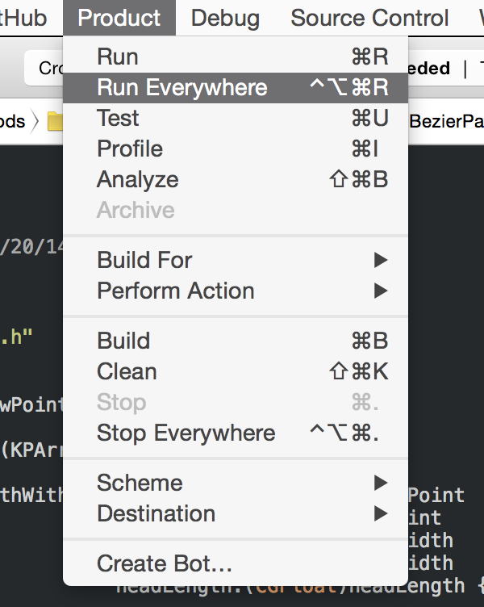

# RunEverywhere Xcode Plugin

-----

### Overview
**An Xcode 7 plugin to build and run an app across multiple iOS devices with one click.**

Gone are the days of manually switching between device destinations and fiddling with the "play" and "stop" buttons. RunEverywhere streamlines development and testing across multiple iPhone / iPod models. This is especially handy if you're building multi-player games, universal apps, or networked apps in general.

The plugin adds two new commands to Xcode's "Product" menu.

**Run Everywhere** <kbd>⌃</kbd> + <kbd>⌥</kbd> + <kbd>⌘</kbd> + <kbd>R</kbd>

Builds and runs the app on all attached devices.

**Stop Everywhere** <kbd>⌃</kbd> + <kbd>⌥</kbd> + <kbd>⌘</kbd> + <kbd>.</kbd>

Stops the app on all attached devices.

-----

### Installation
Two options here:

##### Via Alcatraz
RunEverywhere is available through the [Alcatraz](http://alcatraz.io) Xcode plugin management system.

##### From source
Simply build the Xcode project and restart Xcode. The plugin will automatically install to `~/Library/Application Support/Developer/Shared/Xcode/Plug-ins/`.

To uninstall, just remove the plugin from the above directory, and restart Xcode:

	rm -rf ~/Library/Application\ Support/Developer/Shared/Xcode/Plug-ins/KPRunEverywhereXcodePlugin.xcplugin

-----

### Compatibility
KPRunEverywhere is compatible with Xcode 5, 6, and 7.

It's specifically tested and known to work on:

- Xcode 5.1.0 + Mac OS X 10.9.2
- Xcode 6.0.1 + Mac OS X 10.9.5
- Xcode 6.3.0 + Mac OS X 10.10.3
- Xcode 7.0.1 + Mac OS X 10.11.0
- Xcode 7.1.0 + Mac OS X 10.11.1

-----

### Limitations
This isn't going to work on the simulator.

Running everywhere might not work if Xcode loses focus during to app-launch process. I recommend giving Xcode a second to collect itself after invoking Run Everywhere. This is an unfortunate side-effect of the menu-manipulating implementation.

Unfortunately, Apple removed support for traditional plugins in Xcode 8, and the new official APIs do not allow the functionality implemented in KPRunEverywhere. Any progress on this front will be tracked in [issue #17](https://github.com/kitschpatrol/KPRunEverywhereXcodePlugin/issues/17).

-----

### Thanks
Built with [Delisa Mason's](https://github.com/kattrali) super handy [Xcode Plugin Template](https://github.com/kattrali/Xcode-Plugin-Template).

Inspiration was drawn from a couple of Stack Overflow threads:

- [How to 'Build & Run' on multiple destinations at once in Xcode?](http://stackoverflow.com/questions/16262553/how-to-build-run-on-multiple-destinations-at-once-in-xcode)

- [Xcode 4 - One Click Build to Multiple Devices?](http://stackoverflow.com/questions/8040940/xcode-4-one-click-build-to-multiple-devices?lq=1)

- [Run on simulator and phone with one click](http://stackoverflow.com/questions/15300241/run-on-simulator-and-phone-with-one-click)

- [Is it possible to run an app on two devices with one click on the build and run button in Xcode 5?](http://stackoverflow.com/questions/22116564/is-it-possible-to-run-an-app-on-two-devices-with-one-click-on-the-build-and-run?lq=1)

-----

### Author
Eric Mika  
[github.com/kitschpatrol](http://github.com/kitschpatrol)  
[@kitschpatrol](https://twitter.com/kitschpatrol)

-----

### License
MIT

