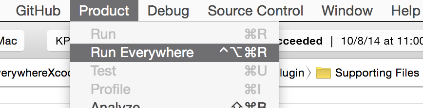

#RunEverywhere Xcode Plugin

-----

###Overview
**An Xcode 5 plugin to build and run apps across multiple iOS devices with one click.**

Gone are the days of manually switching between device destinations and fiddling with the "play" and "stop" buttons. RunEverywhere is particularly useful for testing networked projects or multiple iPhone / iPod models.

The plugin adds two new commands to Xcode's "Product" menu.

**Run Everywhere** <kbd>⌃</kbd> + <kbd>⌥</kbd> + <kbd>⌘</kbd> + <kbd>R</kbd>

Builds and runs the app on all attached devices.

**Stop Everywhere** <kbd>⌃</kbd> + <kbd>⌥</kbd> + <kbd>⌘</kbd> + <kbd>.</kbd>

Stops the app on all attached devices.

-----

###Installation
Two options here:

#####Via Alcatraz
RunEverywhere will be available through the [Alcatraz](http://alcatraz.io) Xcode plugin management system.

#####From source
Simply build the Xcode project and restart Xcode. The plugin will automatically install to `~/Library/Application Support/Developer/Shared/Xcode/Plug-ins`. To uninstall, just remove the plugin from there (and restart Xcode).

Tested on Xcode 5.1 and Mac OS X 10.9.2.

-----

###Limitations
This isn't going to work on the simulator.

-----

###Thanks
Built with [Delisa Mason's](https://github.com/kattrali) super handy [Xcode 5 Plugin Template](https://github.com/kattrali/Xcode5-Plugin-Template).

Inspiration was drawn from a couple of Stack Overflow threads:

- [How to 'Build & Run' on multiple destinations at once in Xcode?](http://stackoverflow.com/questions/16262553/how-to-build-run-on-multiple-destinations-at-once-in-xcode)

- [Xcode 4 - One Click Build to Multiple Devices?](http://stackoverflow.com/questions/8040940/xcode-4-one-click-build-to-multiple-devices?lq=1)

- [Run on simulator and phone with one click](http://stackoverflow.com/questions/15300241/run-on-simulator-and-phone-with-one-click)

-----

###Author
Eric Mika  
[github.com/kitschpatrol](http://github.com/kitschpatrol)

-----

###License
MIT

